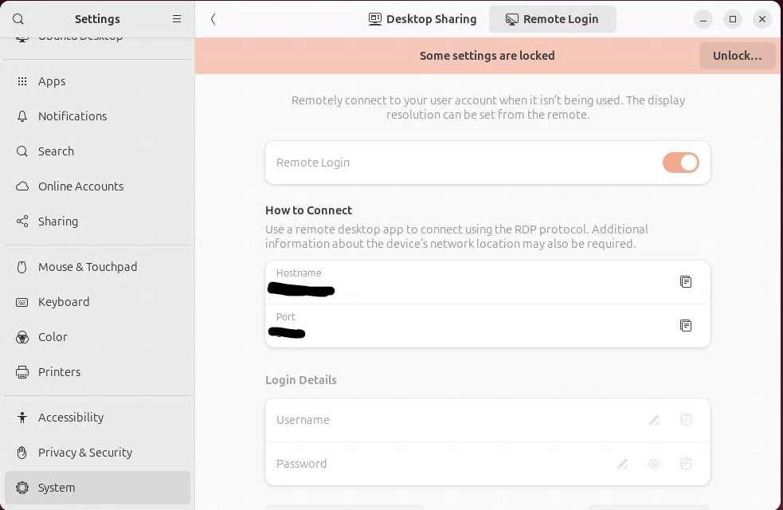
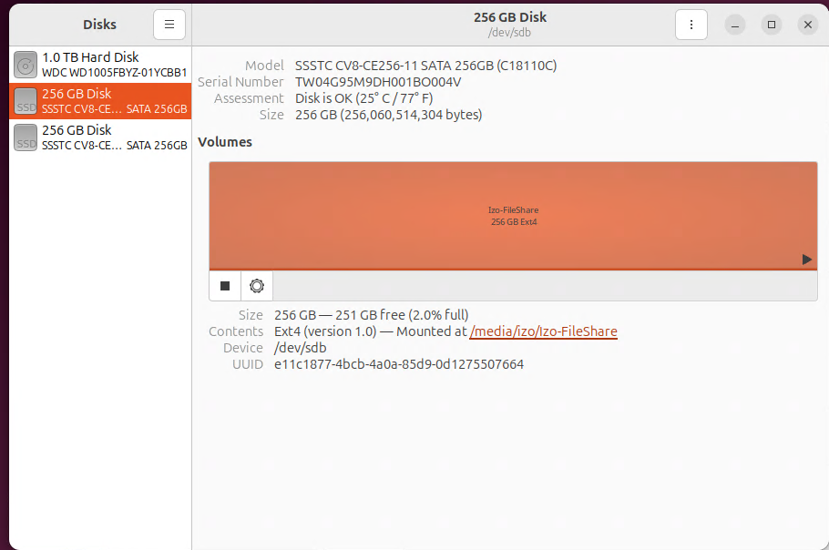
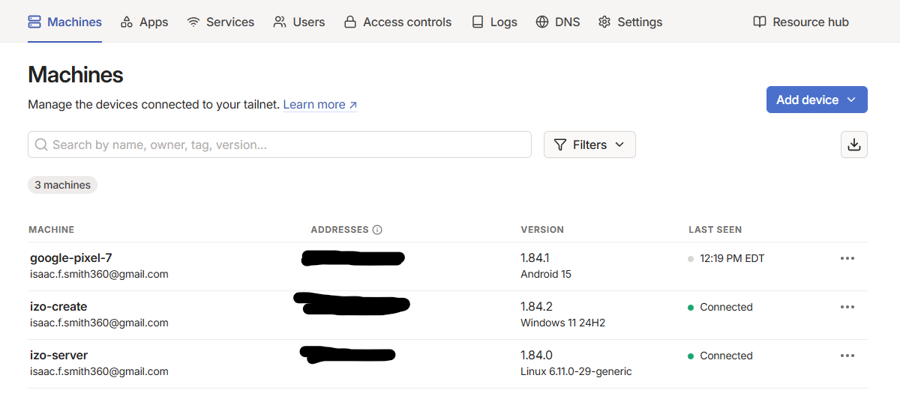
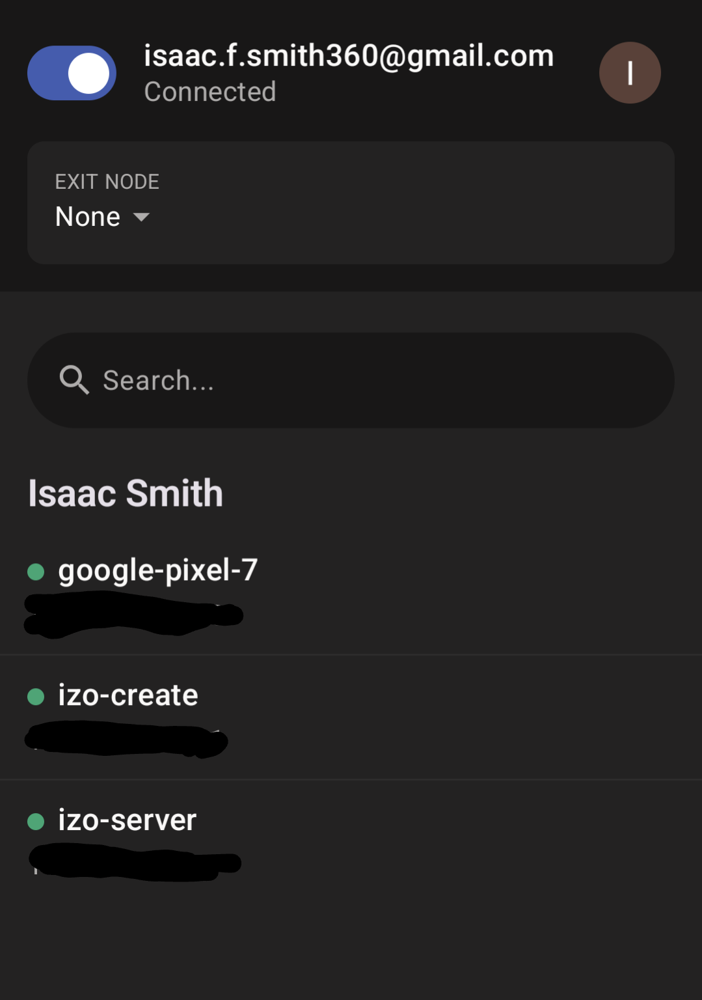
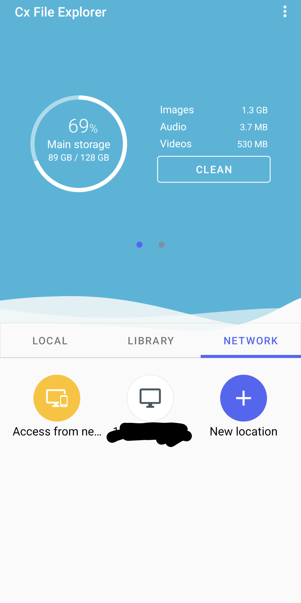

[Back To Main Page](./index.md)

# SMB File Server and VPN with TailScale

I created a file server using Ubuntu 24.04 and setting it up to use SMB to share files locally on my home network and set up TailScale to enable the use of the server wherever I go

## Making The Ubuntu Machine

### Installing Ubuntu 24.04
Using a preconfigured Ventoy stick, I installed the OS onto the machine with default settings

### Enabling RDP
Once the OS is installed I wanted to be able to remote into the machine to configure more from my desk

I intially tried out several different solutions but decided to stick with the native RDP within Ubuntu 24.04





### Mounting The Share Drive
I got a separate drive for this project that I installed before installing the OS
I mounted it using the Disks app in Ubuntu and formatted it as EXT4




### Setting Up SMB

I opened up the terminal and installed Samba using

```bash
sudo apt update
sudo apt install samba
```
Once it was done installing I created the main share folder on the new drive I just mounted

```bash
mkdir /media/izo/Izo-FileShare/AptShare
```

I then edited the config file 
```bash
sudo nano /etc/samba/smb.conf
[AptShare]
    comment = My Apartment File Server
    path = /media/izo/Izo-FileShare/AptShare
    read only = no
    browsable = yes
```
Then I restarted the service and allowed for samba traffic to the machine
```bash
sudo service smbd restart
sudo ufw allow samba
```
### Configuring TailScale
TailScale is relatively easy to set up as there is a set up that walks you through when you create your account
I used my Google account to sign up for TailScale and added my phone, PC, and my server




After getting TailScale on all of my devices, I can get to my server anywhere I am at.

#### Setting up TailScale on your Phone
Tailscale is on the App Store and the Google Play Store
Logging into it will sign your phone up to be a part of the network and will have your phone show all your connections



### Getting Access To My Server On My Phone
With Tailscale on my phone, I still needed an app to view the files and I could not get the files app for Google to work for me
I instead got Cx File Explorer from the Google Play Store

After installing the app I wenth through the following process:

1.  Network Tab
2.  New Location
3.  Remote Tab
4.  SMB
5.  Entered the host IP from TailScale
6.  username and pw from the SMB setup

   
