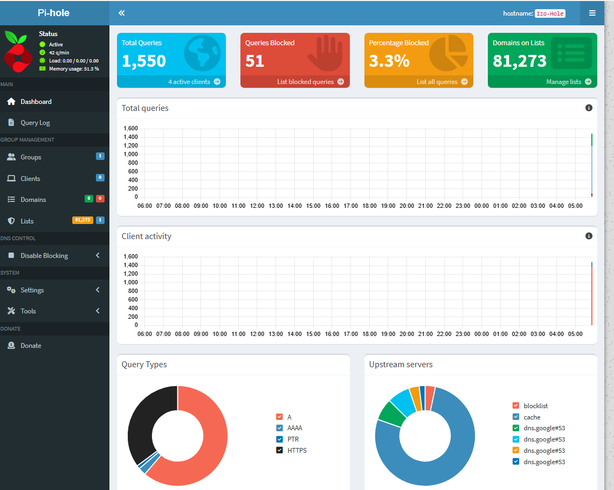

[Back To Main Page](../index.md)

# Pi-Hole Home DNS Server with Ad-Block

I Configured Pi-Hole on a Raspberry Pi Zero 2 W with the Ubuntu 25.10 Server Operating System

## Making The Ubuntu Machine

### Installing Ubuntu 25.10
I used the [Raspberry Pi Imager](https://www.raspberrypi.com/software/) to install [Ubuntu 25.10 Server] (https://ubuntu.com/download/server)
Within the Pi Imager, I set custom settings to enable set up the local login information, enable SSH, and gave it the WiFi login credentials.
I then ran updates and installed net-tools on the Pi
```bash
sudo apt update
sudo apt-get upgrade
sudo apt install net-tools
```

### Pi Hole Setup
Pi-Hole requires a static IP address to function properly
I set my Pi to have a static IP inside the my home network's router
After I restarted the Pi to make sure it gets the assigned IP

I started the automated install of Pi-Hole with the following commands:
```bash
sudo -i
curl -sSL https://install.pi-hole.net | bash
```
The installer then guided me through the main process

### Setting The DNS On The PC
On a Windows PC, I simply went the network connections and entered the IP of my Pi in both the primary and secondary DNS addresses

Linux was a bit more involved
I opened the terminal and entered the following:
```bash
sudo systemctl disable systemd-resolved
sudo systemctl stop systemd-resolved
```
This stopped the auto resolution for DNS queries that bypass the Pi
I went to /etc/resolv.conf and edited nameserver to have the IP of my Pi

### Setting DNS On The Whole Network
You can set the DNS to run through the whole network if you set the DNS in your router to be the Pi


### Finished Set Up
The Setup is now done and I am able to manage my own DNS




### Official Documentation
The documentaion from the team that manages Pi-Hole can be found [here.](https://docs.pi-hole.net/)


